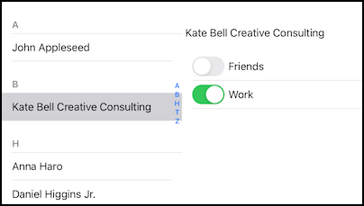

#  ContactGrouper

An app to let the user quickly add and remove existing contacts from existing groups.

Running in iPod Touch simulator in landscape mode, it looks like this:

It operates only on non-unified contacts in the default container.

Annoyingly, this works in the iOS 15 simulator and on the macOS Monterey, and on iPads, both 
iOS 15 and iOS 12, but on an actual iOS 15 iPhone any attempt to change the association between
a contact and its groups returns:

    CNErrorDomain Code=2 "(null)"

which comes from the line:

    if ([self.store executeSaveRequest:request error:&error]) {

in -[ContactGroupViewController cellDidChange:]

with no additional information.

on an iPhone, ContactGrouper is best used in landscape mode.

All the interesting code is in ContactGroupViewController.m

Version 1.1 - backport to also support iOS 12.

Version 1.2 - two column user interface: select a contact, edit its group membership.

Version 1.3 - Dynamic type support. Support for other apps changing the contact database while ContactGrouper is running.

## Apache License

Released under the Apache version 2 license.

